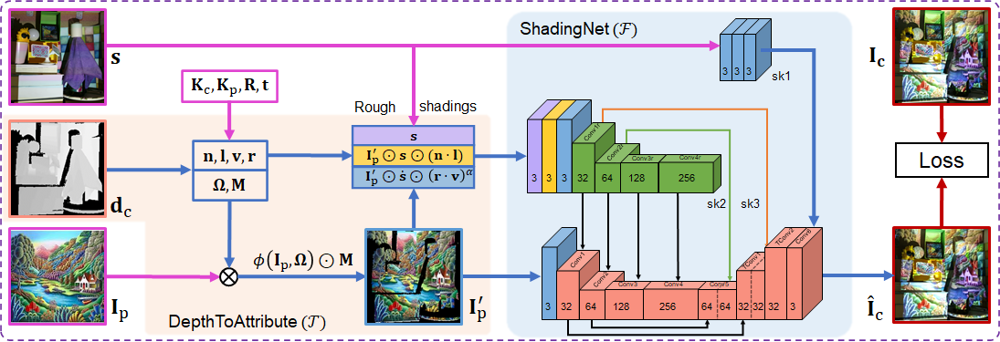
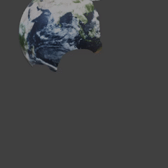
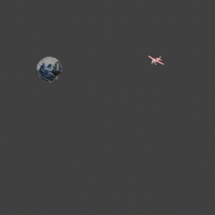
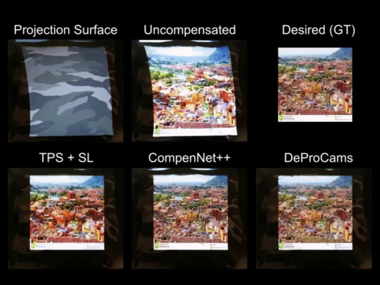
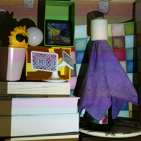
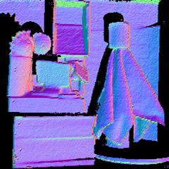
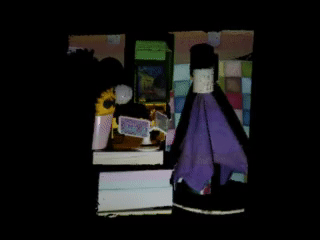
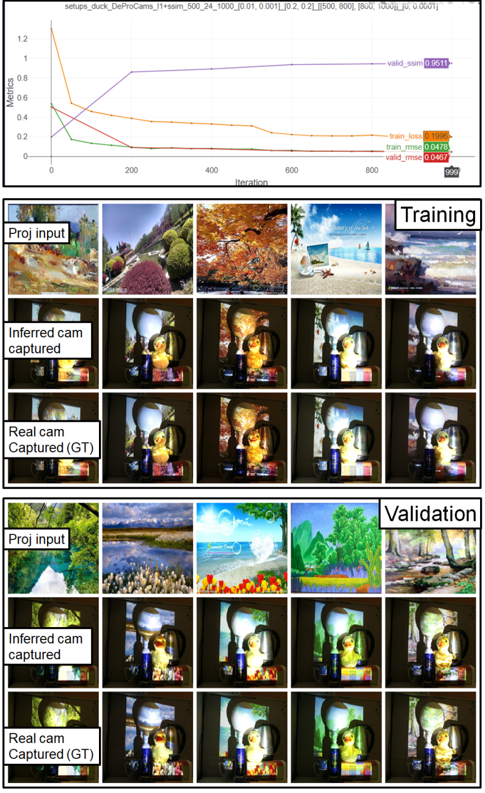
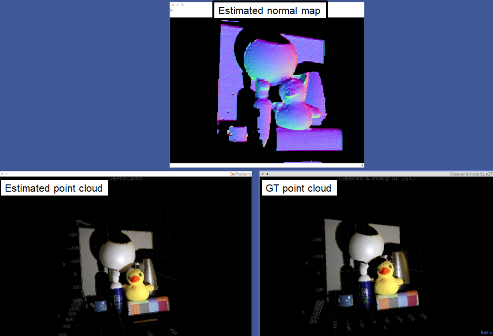

# DeProCams: Simultaneous Relighting, Compensation and Shape Reconstruction for Projector-Camera Systems [IEEE TVCG/VR'21] 

  

----

## Introduction
PyTorch implementation of DeProCams ([paper][1]). Please refer to [supplementary material (~136MB)][2] and [video](https://youtu.be/pQ8k4AOhwlU) for more results.
The proposed DeProCams can simultaneously perform three spatial augmented reality (SAR) tasks with one learned model: **image-based relighting**, **projector compensation** and **depth/normal estimation**, as shown below.

### 1. Relighting
Potential applications can be (1) to virtually store and share the SAR setup, and simulate fancy projection mapping effects; (2) Or use DeProCams to debug SAR application, e.g., adjust projection patterns without actual projections.

We show two setups in two rows. The left are projector input video frames, and the right are DeProCams inferred relit results. The relit effects can be reproduced by setting data_list to `data_list = ['setups/duck', 'setups/towel']` in [`train_DeProCams.py`](src/python/train_DeProCams.py). 

  
    
  
  

### 2. Projector compensation

#### Real camera-captured compensated single images (see [`video_cmp_demo.py`](src/python/video_cmp_demo.py))

  

#### Real camera-captured compensated movie (see [`video_cmp_demo.py`](src/python/video_cmp_demo.py))

  

*Big buck bunny. (c) copyright 2008, Blender Foundation. www.bigbuckbunny.org. Licensed under CC BY 3.0.*

### 3. Shape reconstruction
Left is camera-captured scene, middle is DeProCams estimated normal and right is DeProCams estimated point cloud.

  
  
  

----

## Prerequisites
* PyTorch compatible GPU with CUDA 10.2
* Python 3
* [visdom](https://github.com/fossasia/visdom) (for visualization), recommend [installing from source](https://github.com/fossasia/visdom#setup) for better point cloud visualization.
* [kornia](https://github.com/kornia/kornia) (for differentiable warping). We adapt [this version](https://github.com/kornia/kornia/tree/d1dedb8d37f99b752467ed4acaf4f767afbbad49) to our project for better training performance, and include it in this repository.
* Other packages are listed in [requirements.txt](requirements.txt).

## Usage
### 

1. Clone this repo:
   
        git clone https://github.com/BingyaoHuang/DeProCams
        cd DeProCams

2. Install required packages by typing
   
        pip install -r requirements.txt

3. [Install visdom from source](https://github.com/fossasia/visdom#setup).
   
4. Download DeProCams [benchmark dataset][3] and extract to [`data/`](data)

5. Start **visdom** by typing

        visdom -port 8098

6. Once visdom is successfully started, visit [`http://localhost:8098`](http://localhost:8098) (train locally) or `http://serverhost:8098` (train remotely).
   
7. Open [`train_DeProCams.py`](src/python/train_DeProCams.py) and set which GPUs to use. An example is shown below, we use GPU 1 to train the model.
   
        os.environ['CUDA_VISIBLE_DEVICES'] = '1'
        device_ids = [0]

8. Run [`train_DeProCams.py`](src/python/train_DeProCams.py) to reproduce benchmark results.

        cd src/python
        python train_DeProCams.py

9.  The training and validation results are updated in the visdom webpage during training. An example is shown below, where the 1st figure shows the training and validation loss, RMSE and SSIM curves. The 2nd and 3rd montage figures are the training and validation pictures, respectively. In each montage figure, the **1st rows are the projector input images (Ip); the 2nd rows are DeProCams inferred camera-captured projection (\hat{I}c); and the 3rd rows are real camera-captured projection (Ic), i.e., ground truth**. 

  

10.  DeProCams estimated normal map, point cloud and ground truth point cloud will be shown in visdom webpage after training. You can use mouse to interact with the point cloud. Note that if visdom is NOT installed from source (e.g., `pip install visdom`) the point cloud points may have undesirable black edges.

11. The quantitative evaluation results will be saved to `log/%Y-%m-%d_%H_%M_%S.txt` for comparison.

----
## Apply DeProCams to your own setup

1. Create a setup data directory `data/setups/[name]` (we refer it to `data_root`), where `[name]` is the name of the setup, e.g., duck.
2. Calibrate the projector-camera system, and obtain the intrinsics and extrinsics. You can use the MATLAB software in [Huang et.al, A Fast and Flexible Projector-Camera Calibration System. IEEE T-ASE, 2020](https://github.com/BingyaoHuang/single-shot-pro-cam-calib). Then, convert the calibration and save it to `data/setups/[name]/params/params.yml`. 
3. Project and capture the images in `data/ref/`, `data/train` and `/data/test`, and save the captured images to `data_root/cam/raw/ref/`, `data_root/cam/raw/train`,  `data_root/cam/raw/test`, respectively.
4. [**Optional for depth evaluation**] Capture the scene point cloud using [Moreno & Taubin's SL software](http://mesh.brown.edu/calibration/), and manually clean and interpolate it, then convert it to the ground truth depth map and save it as `data_root/gt/depthGT.txt`. This step is only needed when you want to quantitatively evaluate DeProCams estimated point cloud, otherwise comment the code related to `depthGT.txt` to avoid SL.
5. [**Optional for compensation**] Similar to [CompenNet++][4], we first find the optimal displayable area. Then, affine transform the images in `data/test` to the optimal displayable area and save transformed images to `data_root/cam/raw/desire/test`. Exemplar images are shown in `data/setups/camo_cmp/cam/raw/desire/`. Run [`video_cmp_demo.py`](src/python/video_cmp_demo.py) to see how compensation works.
6. [**Optional for relighting**] Put projector input relighting patterns, e.g., some animated projection mapping patterns in `data_root/prj/relit/frames`. Once DeProCams is trained, relit results will be saved to `data_root/pred/relit/frames`. Exemplar images are shown in `data/setups/duck` and `data/setups/towel`.
7. Add this setup `setups/[name]` to `data_list` in [`train_DeProCams.py`](src/python/train_DeProCams.py) and run it.
8. After training (takes about 2.5 min on an Nvidia RTX 2080Ti), the estimated normal maps, depth maps, relit results will be saved to `data_root/pred`. Compensated images will be saved to `data_root/prj/cmp` (if `data_root/cam/raw/desire` is not empty).
9. [**Optional for compensation**] Finally, project the compensated projector input images under `data_root/prj/cmp/test/` to the scene and see real compensation results. You can take advantage of compensation for appearance editing, e.g., first edit the desired effects on `data_root/cam/raw/ref/img_0003.png`, then save the edited effects to `data_root/cam/desire/frames`, afterwards compensate the desire frames, and finally project the compensation images to the scene.
10. For more details see comments in [`train_DeProCams.py`](src/python/train_DeProCams.py).

**Feel free to open an issue if you have any questions, or if you want to share other interesting DeProCams applications, e.g., recursive DeProCams like this: `relight(compensate(relight(compensate(I))))`😂**

----
## Citation
If you use the dataset or this code, please consider citing our work

    @article{huang2021DeProCams,
        title={DeProCams: Simultaneous Relighting, Compensation and Shape Reconstruction for Projector-Camera Systems},
        author={Bingyao Huang and Haibin Ling},
        journal = {IEEE Transactions on Visualization and Computer Graphics (TVCG)},
        doi = {10.1109/TVCG.2021.3067771},
        year={2021}
    }

## Acknowledgments
- This code borrows heavily from [CompenNet][5] and [CompenNet++][4].
- The PyTorch implementation of SSIM loss is modified from [Po-Hsun-Su/pytorch-ssim](https://github.com/Po-Hsun-Su/pytorch-ssim).
- We adapted [this version of kornia](https://github.com/kornia/kornia/tree/d1dedb8d37f99b752467ed4acaf4f767afbbad49) in our code. The main changes are in `kornia.geometry.warp.depth_warper`, where we added functions to speed up training/inference. Please use git diff to see details changes.
- We thank the anonymous reviewers for valuable and inspiring comments and suggestions.
- We thank the authors of the colorful textured sampling images. 

## License
This software is freely available for non-profit non-commercial use, and may be redistributed under the conditions in [license](LICENSE).

<!-- [1]: https://arxiv.org/pdf/2003.03040.pdf -->
[1]: https://vision.cs.stonybrook.edu/~bingyao/pub/DeProCams
[2]: https://vision.cs.stonybrook.edu/~bingyao/pub/DeProCams_supp
[3]: https://vision.cs.stonybrook.edu/~bingyao/pub/data/DeProCams
[4]: https://github.com/BingyaoHuang/CompenNet-plusplus
[5]: https://github.com/BingyaoHuang/CompenNet
